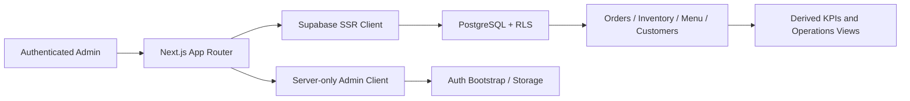

# Shama's Kitchen Operations Dashboard

Authenticated operations software for a real pickup-first food business, built with **Next.js**, **TypeScript**, **Supabase**, and **PostgreSQL**.

The dashboard centralizes orders, inventory, menu controls, customers, email signups, operational KPIs, and business insights. It supports a production Supabase data source and an explicitly enabled mock mode for safe portfolio review.

## Highlights

- Authenticated admin dashboard for daily business operations
- Orders, line items, customer history, and payment-state visibility
- Inventory levels, par targets, low-stock signals, and menu-item links
- Menu pricing, availability, nutrition, merchandising, and image controls
- Derived revenue, order-volume, stock-health, and prep-confidence KPIs
- Supabase SSR authentication and PostgreSQL Row Level Security
- Server-only service-role access for privileged bootstrap and storage tasks
- Explicit mock-data mode with fictional customers and sample operations data

## Technology

**Next.js 16 · React 19 · TypeScript · Supabase SSR · PostgreSQL · Row Level Security · ESLint**

## Architecture



The normal dashboard data path uses the authenticated Supabase client and remains subject to Row Level Security. The service-role client is imported from a `server-only` module and is limited to privileged server-side tasks.

## Security model

- Production access requires a verified Supabase session.
- The session must map to an active `admin_memberships` record.
- Core tables use PostgreSQL Row Level Security.
- Non-admin users cannot mutate operational tables.
- The Supabase service-role key is never exposed to browser code.
- Mock-mode authentication bypass is available only when `NEXT_PUBLIC_USE_MOCK_DATA` is explicitly set to `true` and Supabase auth is not configured.
- The checked-in seed customers use `example.com` addresses and reserved `555` phone numbers.

## Local demo

Copy the environment template:

```bash
cp .env.example .env.local
```

Keep mock mode explicitly enabled:

```dotenv
NEXT_PUBLIC_USE_MOCK_DATA=true
```

Install and start the app:

```bash
npm ci
npm run dev
```

Open `http://localhost:3000`.

## Supabase setup

1. Create a Supabase project.
2. Apply `supabase/schema.sql`.
3. Apply any later files in `supabase/migrations/`.
4. Optionally apply `supabase/seed.sql` for fictional demonstration data.
5. Configure `.env.local`:

```dotenv
NEXT_PUBLIC_USE_MOCK_DATA=false
NEXT_PUBLIC_SUPABASE_URL=https://your-project.supabase.co
NEXT_PUBLIC_SUPABASE_PUBLISHABLE_KEY=your_publishable_key
SUPABASE_SERVICE_ROLE_KEY=your_server_only_service_role_key
MOGRILLZ_MENU_IMAGE_BUCKET=menu-images
```

`SUPABASE_SERVICE_ROLE_KEY` is server-only. Do not prefix it with `NEXT_PUBLIC_` and do not expose it to client components.

## First administrator

Use the server-only bootstrap script to create or invite the initial owner and attach the account to `admin_memberships`.

Create a confirmed user:

```bash
npm run admin:create -- \
  --email owner@example.com \
  --name "Business Owner" \
  --mode create \
  --password "replace-with-a-strong-password"
```

Or send an invitation:

```bash
npm run admin:create -- \
  --email owner@example.com \
  --name "Business Owner" \
  --mode invite
```

Run the bootstrap command only from a trusted machine or server where the service-role key is available.

## Data model

The Supabase schema includes:

- `admin_memberships`
- `customers`
- `drop_reminders`
- `menu_items`
- `inventory_items`
- `inventory_item_menu_links`
- `orders`
- `order_items`
- `insights`

The schema also defines indexes, update triggers, authorization helpers, and table-specific RLS policies.

## Validation

Run the public quality gate:

```bash
npm run check
```

This executes:

- ESLint
- TypeScript type checking
- Next.js production build in explicit mock mode

GitHub Actions runs the same gate for pull requests and pushes to `main`.

## Production boundaries

This repository demonstrates the authenticated operations application and database authorization model. A complete production deployment still requires environment-specific Supabase configuration, domain configuration, monitoring, backups, deployment controls, and operational ownership of business data.

No production credentials or real customer records are included.

## License

Publicly available for portfolio and evaluation purposes. All rights reserved; see `LICENSE`.
