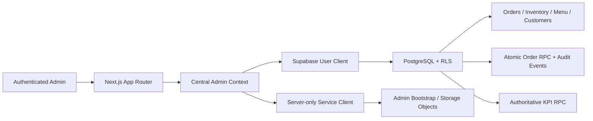

# Shama's Kitchen Operations Dashboard

Authenticated operations software for a pickup-first food business, built with **Next.js**, **TypeScript**, **Supabase**, and **PostgreSQL**.

The dashboard centralizes orders, inventory, menu controls, customers, email signups, operational KPIs, and business insights. It supports a production Supabase data source and an explicitly enabled mock mode for safe portfolio review.

## Highlights

- Authenticated daily operations dashboard
- Kitchen order state machine with confirmation for risky transitions
- Atomic, idempotency-aware status updates and an append-only event trail
- Inventory levels, par targets, low-stock signals, and menu-item links
- Menu pricing, availability, nutrition, merchandising, and normalized image controls
- Authoritative PostgreSQL summary KPIs for live operations
- Bounded history queries with partial degradation for noncritical sections
- Supabase SSR authentication and PostgreSQL Row Level Security
- Server-only service-role access limited to bootstrap and storage operations
- Explicit mock-data mode with fictional customers and sample operations data

## Technology

**Next.js 16 · React 19 · TypeScript · Supabase SSR · PostgreSQL · Row Level Security · Sharp · Node test runner · ESLint**

## Architecture



Normal reads and database writes use the authenticated Supabase client and remain subject to Row Level Security. The service-role client is imported from a `server-only` module and is requested only for privileged operations such as initial administration and storage-object management.

## Security model

- Production access requires a verified Supabase session.
- The session must map to an active `admin_memberships` record with an allowed role.
- Membership evaluation fails closed when expected role or active-state data is absent.
- Core tables use PostgreSQL Row Level Security.
- Ordinary menu, inventory, order-note, and image-metadata writes use the RLS-bound user client.
- The Supabase service-role key is never exposed to browser code.
- Mock-mode authentication bypass is available only when `NEXT_PUBLIC_USE_MOCK_DATA` is explicitly `true` and Supabase auth is not configured.
- The checked-in seed customers use `example.com` addresses and reserved `555` numbers.

## Order lifecycle

The supported forward workflow is:

```text
New -> In Prep -> Ready -> Picked Up
```

`New`, `In Prep`, and `Ready` can be cancelled. Completed or cancelled orders cannot transition again.

The database transition function:

- Locks the order row
- Validates the current and requested states
- Serializes concurrent requests sharing an idempotency key
- Replays only an identical operation using the same key
- Rejects cross-operation idempotency-key reuse
- Increments an order version
- Records lifecycle timestamps
- Inserts one `order_status_events` audit record
- Returns conflicts without silently overwriting newer state

## Menu image pipeline

Menu uploads accept JPEG, PNG, WebP, or AVIF input up to 5 MB, then:

- Decode the source instead of trusting only the MIME header
- Reject malformed or oversized-pixel inputs
- Auto-rotate from image orientation
- Bound the longest side to 1600 pixels without enlargement
- Encode a metadata-stripped WebP object
- Write image metadata through the authenticated RLS-bound client
- Roll back the new object if the database update fails

Storage bucket creation and configuration are separate from the live request path.

## Local demo

```bash
cp .env.example .env.local
npm ci
npm run dev
```

Keep mock mode explicitly enabled:

```dotenv
NEXT_PUBLIC_USE_MOCK_DATA=true
```

Open `http://localhost:3000`.

## Supabase setup

1. Create a Supabase project.
2. Apply `supabase/schema.sql` for a fresh project.
3. Apply every file in `supabase/migrations/` in order.
4. Optionally apply `supabase/seed.sql` for fictional demonstration data.
5. Configure `.env.local`:

```dotenv
NEXT_PUBLIC_USE_MOCK_DATA=false
NEXT_PUBLIC_SUPABASE_URL=https://your-project.supabase.co
NEXT_PUBLIC_SUPABASE_PUBLISHABLE_KEY=your_publishable_key
SUPABASE_SERVICE_ROLE_KEY=your_server_only_service_role_key
MOGRILLZ_MENU_IMAGE_BUCKET=menu-images

# Optional HTTPS sidebar links. Blank values hide the links.
NEXT_PUBLIC_SHAMAS_KITCHEN_SITE_URL=
NEXT_PUBLIC_SHAMAS_KITCHEN_SOCIAL_AGENT_URL=
```

`SUPABASE_SERVICE_ROLE_KEY` is server-only. Do not prefix it with `NEXT_PUBLIC_`.

Before deploying the application, verify the production schema and storage from a trusted environment:

```bash
npm run db:preflight
npm run storage:provision
```

The current application requires schema version `2026073002` or newer. See `docs/DEPLOYMENT.md` for the migration-first release and rollback runbook.

## First administrator

Create a confirmed user:

```bash
npm run admin:create -- \
  --email owner@example.com \
  --name "Business Owner" \
  --mode create \
  --password "replace-with-a-strong-password"
```

Or send an invitation:

```bash
npm run admin:create -- \
  --email owner@example.com \
  --name "Business Owner" \
  --mode invite
```

Run this command only from a trusted machine or server where the service-role key is available.

## Data model

Core tables include:

- `admin_memberships`
- `customers`
- `drop_reminders`
- `menu_items`
- `inventory_items`
- `inventory_item_menu_links`
- `orders`
- `order_items`
- `order_status_events`
- `insights`

The schema also defines indexes, update triggers, authorization helpers, lifecycle RPCs, aggregate KPI RPCs, and table-specific RLS policies.

## Validation

Run the complete application quality gate:

```bash
npm run check
```

This executes:

- High-severity production dependency audit
- ESLint
- TypeScript type checking
- Behavioral tests with Node's built-in test runner
- Next.js production build

GitHub Actions also starts PostgreSQL 17, applies the schema and migrations from an empty database, and verifies lifecycle transitions, idempotency, audit events, authorization, schema versioning, and aggregate KPI behavior.

## Production boundaries

A production deployment still requires environment-specific Supabase and domain configuration, backups, deployment controls, structured-log ownership, smoke testing, and a named operator responsible for the release.

No production credentials or real customer records are included.

## License

Publicly available for portfolio and evaluation purposes. All rights reserved; see `LICENSE`.
